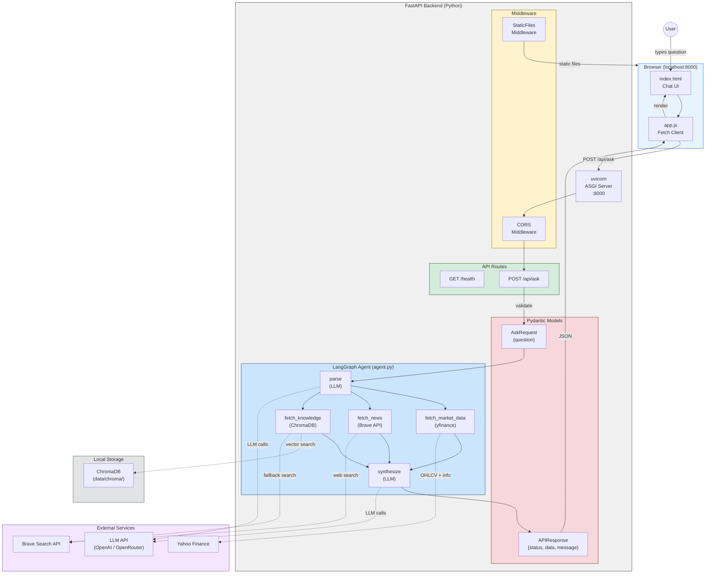

# Financial QA Agent

A financial question-answering agent with a Python/FastAPI backend and a vanilla web frontend for demo purposes.

## Quick Start

```bash
# Install dependencies
uv sync

# Copy and fill in environment variables
cp .env.example .env
# Edit .env with your API keys (LLM_API_KEY, BRAVE_API_KEY)

# Start the server (backend + frontend)
uv run uvicorn src.financial_qa_agent.main:app --reload --port 8000

# Open in browser
open http://localhost:8000

# Run tests
uv run pytest -v
```

---

## Architecture

### 1. System Architecture — Components, Data Flow & Interaction



**Interaction Pattern**: The frontend sends `POST /api/ask` via `fetch()`. FastAPI validates through Pydantic, then delegates to the LangGraph agent. The agent parses the question into structured entities (tickers, time period, news flag, knowledge queries), routes to one or more fetch tools based on what was extracted, and synthesizes a final answer via an LLM call. The response returns as a JSON envelope `{status, data, message}`.

---

### 2. Agent Loop — Question Processing Pipeline

```
User Question
     │
     ▼
┌─────────────┐
│    parse     │  ← LLM call: extract tickers, time period, news flag, knowledge queries
└──────┬──────┘
       │  (route by parse result — no classification label)
       │
       ├── tickers found?        ──► fetch_market_data   (yfinance OHLCV + fundamentals)
       ├── needs_news = true?    ──► fetch_news          (Brave Search API)
       ├── knowledge_queries?    ──► fetch_knowledge     (ChromaDB lookup → if sparse, Brave search → save to ChromaDB)
       └── nothing extracted?    ──► fetch_knowledge     (fallback)
       │
       │  (multiple tools fire in parallel when multiple fields are populated)
       ▼
┌─────────────┐
│ synthesize   │  ← LLM call with parse result + ALL fetched context + original question → final answer
└──────┬──────┘
       │
       ▼
┌─────────────┐
│  response    │  ← Structure into API envelope {status, data, message}
└─────────────┘
```

**Routing is data-driven**: tool selection depends on which parse result fields are populated, not a classification label. Multiple tools can fire in parallel.

---

### 3. Project Structure

```
financial-qa-agent/
├── README.md                       --- Project documentation with architecture diagrams
├── CLAUDE.md                       --- Development rules and conventions for Claude
├── pyproject.toml                  --- uv project config, dependencies, pytest settings
├── uv.lock                         --- Locked dependency versions
├── .env.example                    --- Template for required environment variables
├── .gitignore                      --- Git ignore rules
│
├── src/financial_qa_agent/         --- Backend Python package
│   ├── __init__.py                 --- Package marker
│   ├── config.py                   --- Settings via pydantic-settings (LLM, Brave, ChromaDB)
│   ├── main.py                     --- FastAPI app: routes, Pydantic models, static mount
│   ├── agent.py                    --- LangGraph agent: parse → fetch → synthesize pipeline
│   └── tools/                      --- Data fetching tool modules
│       ├── __init__.py             --- Tool exports
│       ├── market_data.py          --- yfinance: OHLCV, fundamentals, ticker extraction
│       ├── news_search.py          --- Brave Search API: recent financial news
│       └── knowledge_base.py       --- ChromaDB vector search + Brave web fallback
│
├── frontend/                       --- Vanilla web UI (no build step)
│   ├── index.html                  --- Chat interface shell
│   ├── style.css                   --- Layout and theme
│   └── app.js                      --- fetch() client, DOM rendering
│
├── tests/                          --- Test suite (all externals mocked)
│   ├── __init__.py
│   ├── conftest.py                 --- Shared fixtures (mock LLM responses)
│   ├── test_api.py                 --- API endpoint tests (4 tests)
│   ├── test_agent.py               --- LangGraph pipeline integration tests (15 tests)
│   └── test_tools.py               --- Tool unit tests (21 tests)
│
├── specs/                          --- Living specifications
│   ├── api.md                      --- Endpoint contracts and response format
│   ├── architecture.md             --- Component overview and data flow
│   └── agent.md                    --- Agent loop design, state schema, tool interfaces
│
├── data/                           --- Runtime data (gitignored)
│   └── chroma/                     --- ChromaDB persistent vector storage
│
└── docs/                           --- Project history
    └── instructions.md             --- Timestamped log of every user instruction
```

---

## API Reference

| Method | Endpoint     | Description                  |
|--------|-------------|------------------------------|
| POST   | `/api/ask`  | Submit a financial question  |
| GET    | `/health`   | Health check                 |

**Request** (`POST /api/ask`):
```json
{ "question": "What is compound interest?" }
```

**Response**:
```json
{
  "status": "ok",
  "data": {
    "question": "What is compound interest?",
    "answer": "..."
  },
  "message": "Question answered successfully"
}
```

All responses follow the envelope: `{ status, data, message }`

---

## Development

| Command | Purpose |
|---------|---------|
| `uv sync` | Install / update dependencies |
| `uv run uvicorn src.financial_qa_agent.main:app --reload --port 8000` | Start dev server |
| `uv run pytest -v` | Run test suite |

### Project Conventions
- **Rules**: See [`CLAUDE.md`](CLAUDE.md) for all development rules
- **Specs**: See [`specs/`](specs/) for API and architecture specifications
- **Instruction log**: See [`docs/instructions.md`](docs/instructions.md) for full history

---

## Tech Stack

- **Backend**: Python 3.13+, FastAPI, uvicorn
- **Agent Orchestration**: [LangGraph](https://langchain-ai.github.io/langgraph/) (StateGraph)
- **LLM Provider**: [langchain-openai](https://python.langchain.com/docs/integrations/chat/openai/) (OpenAI / OpenRouter)
- **Market Data**: [yfinance](https://github.com/ranaroussi/yfinance) (OHLCV, fundamentals)
- **News Search**: [Brave Search API](https://brave.com/search/api/)
- **Knowledge Base**: [ChromaDB](https://www.trychroma.com/) (local vector DB with web fallback)
- **Frontend**: Vanilla HTML / CSS / JS (no build step)
- **Package Manager**: [uv](https://docs.astral.sh/uv/)
- **Testing**: pytest, pytest-asyncio, httpx
