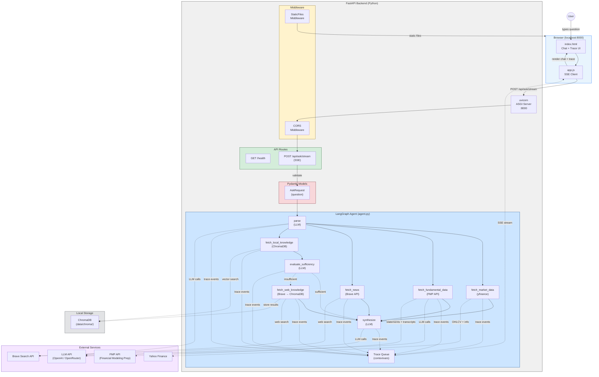

# Financial QA Agent

A financial question-answering agent with a Python/FastAPI backend and a vanilla web frontend for demo purposes.

## Quick Start

```bash
# Install dependencies
uv sync

# Copy and fill in environment variables
cp .env.example .env
# Edit .env with your API keys (LLM_API_KEY, BRAVE_API_KEY)

# Start the server (backend + frontend)
uv run uvicorn src.financial_qa_agent.main:app --reload --port 8000

# Open in browser
open http://localhost:8000

# Run tests
uv run pytest -v
```

---

## Architecture

### 1. System Architecture — Components, Data Flow & Interaction



**Interaction Pattern**: The frontend sends `POST /api/ask/stream` via `fetch()`. FastAPI validates through Pydantic, then launches the LangGraph agent with a trace queue. The agent parses the question into structured entities (tickers, time period, news flag, knowledge queries, fundamental data needs), then routes based on the parser's `question_type`: **analysis** (parser says analysis + tickers present → market data + optional fundamental data + optional news → sectioned answer: Fact + Analysis + References) or **knowledge hub** (parser says knowledge → local ChromaDB first → LLM evaluates sufficiency → if insufficient, web search → sectioned answer: Answer + References; tickers are ignored). For equity tickers, the parser can request FMP fundamental data (financial statements, earnings transcripts); transcripts are summarized via LLM before inclusion. The LLM produces markdown with `##` section headers; the frontend renders it via `marked.js` (sanitized with DOMPurify) so headers, links, lists, bold text, tables, and code all display correctly. Each pipeline stage emits trace events to an `asyncio.Queue`, which the SSE generator streams to the browser in real-time. The frontend renders trace events in a 4-tab trace panel (Agent Loop, Market Data with Price/Fundamental sub-sections, News, Knowledge with Local/Online sub-sections) and the final markdown answer in the chat panel.

---

### 2. Agent Loop — Question Processing Pipeline

```
User Question
     │
     ▼
┌─────────────┐
│    parse     │  ← LLM call: extract tickers, time period, news flag, knowledge queries
└──────┬──────┘
       │  (route by parser's question_type)
       │
       ├── analysis? ────── ANALYSIS PATH ─────────────────────────────────────────────┐
       │   └── fetch_market_data        (yfinance OHLCV + fundamentals)                  │
       │   └── [+ fetch_fundamental_data] (FMP: statements + transcripts, if equity)     │
       │   └── [+ fetch_news]           (Brave Search API, if needs_news)                │
       │                                                                                  │
       ├── knowledge? ──── KNOWLEDGE HUB (tickers ignored) ────────────────────────┐    │
       │   └── fetch_local_knowledge     (ChromaDB vector search)                    │    │
       │          │                                                                  │    │
       │          ▼                                                                  │    │
       │   ┌───────────────────────┐                                                 │    │
       │   │ evaluate_sufficiency   │  ← LLM: are local results enough?              │    │
       │   └──────────┬────────────┘                                                 │    │
       │              │                                                              │    │
       │      ┌───────┴────────┐                                                     │    │
       │      │                │                                                     │    │
       │   sufficient    insufficient                                                │    │
       │      │                │                                                     │    │
       │      │       fetch_web_knowledge  (Brave → store in ChromaDB)               │    │
       │      │                │                                                     │    │
       ▼      ▼                ▼                                                     ▼    ▼
┌─────────────┐                                                              ┌─────────────┐
│ synthesize   │  ← Knowledge prompt (## Answer + ## References)             │ synthesize   │
│ (knowledge)  │                                                             │ (analysis)   │
└──────┬──────┘                                                              └──────┬──────┘
       │                Analysis prompt (## Fact + ## Analysis + ## References) →    │
       ▼                                                                            ▼
┌─────────────┐
│  response    │  ← Frontend parses ## sections, renders clickable links
└─────────────┘
```

**Two question types** driven by the parse LLM's `question_type` field: **Analysis** (parser says "analysis" + tickers present) fetches market data, optionally FMP fundamental data (financial statements + earnings transcripts for equities), and optionally news, producing a sectioned answer: **Fact** (Key Metrics + Summary) + **Analysis** (interpretation) + **References** (news links, if available). **Knowledge** (parser says "knowledge") uses a **knowledge hub** approach: local ChromaDB is queried first, then an LLM evaluates whether the local results sufficiently answer the question — if not, a web search is triggered and results are stored in ChromaDB for future use. Knowledge questions ignore any tickers — no market data or fundamental data is fetched. The final answer is a sectioned response: **Answer** (explanation) + **References** (source links). The LLM outputs markdown; the frontend renders it natively via `marked.js` with DOMPurify sanitization.

---

### 3. Project Structure

```
financial-qa-agent/
├── README.md                       --- Project documentation with architecture diagrams
├── CLAUDE.md                       --- Development rules and conventions for Claude
├── pyproject.toml                  --- uv project config, dependencies, pytest settings
├── uv.lock                         --- Locked dependency versions
├── .env.example                    --- Template for required environment variables
├── .gitignore                      --- Git ignore rules
│
├── src/financial_qa_agent/         --- Backend Python package
│   ├── __init__.py                 --- Package marker
│   ├── config.py                   --- Settings via pydantic-settings (LLM, Brave, ChromaDB)
│   ├── main.py                     --- FastAPI app: routes, Pydantic models, static mount
│   ├── agent.py                    --- LangGraph agent: parse → fetch → synthesize pipeline
│   ├── models.py                   --- Pydantic models: TickerData, NewsResult, trace events, etc.
│   └── tools/                      --- Data fetching tool modules
│       ├── __init__.py             --- Tool exports
│       ├── market_data.py          --- yfinance: OHLCV, fundamentals (tickers from parse node)
│       ├── fundamental_data.py     --- FMP API: financial statements + earnings transcripts
│       ├── news_search.py          --- Brave Search API: recent financial news
│       └── knowledge_base.py       --- Local ChromaDB search + web search with auto-population
│
├── frontend/                       --- Vanilla web UI (no build step)
│   ├── index.html                  --- Two-panel layout + marked.js/DOMPurify CDN
│   ├── style.css                   --- Grid layout, markdown styles, trace entries
│   └── app.js                      --- SSE streaming, markdown rendering, trace panel
│
├── tests/                          --- Test suite (all externals mocked)
│   ├── __init__.py
│   ├── conftest.py                 --- Shared fixtures (mock LLM responses)
│   ├── test_api.py                 --- API endpoint + SSE stream tests (4 tests)
│   ├── test_agent.py               --- LangGraph pipeline + routing + trace tests (38 tests)
│   ├── test_models.py              --- Pydantic model unit tests (37 tests)
│   └── test_tools.py               --- Tool unit tests (40 tests)
│
├── specs/                          --- Living specifications
│   ├── api.md                      --- Endpoint contracts and response format
│   ├── architecture.md             --- Component overview and data flow
│   └── agent.md                    --- Agent loop design, state schema, tool interfaces
│
├── data/                           --- Runtime data (gitignored)
│   └── chroma/                     --- ChromaDB persistent vector storage
│
└── docs/                           --- Project history
    └── instructions.md             --- Timestamped log of every user instruction
```

---

## API Reference

| Method | Endpoint            | Description                          |
|--------|---------------------|--------------------------------------|
| POST   | `/api/ask/stream`   | Submit question with SSE trace streaming |
| GET    | `/health`           | Health check                         |

**Request** (`POST /api/ask/stream`):
```json
{ "question": "What is compound interest?" }
```

**SSE Stream**: Returns `text/event-stream` with events: `trace`, `tool_input`, `tool_output`, `answer`, `error`, `done`. See [`specs/api.md`](specs/api.md) for full SSE event reference.

---

## Development

| Command | Purpose |
|---------|---------|
| `uv sync` | Install / update dependencies |
| `uv run uvicorn src.financial_qa_agent.main:app --reload --port 8000` | Start dev server |
| `uv run pytest -v` | Run test suite |

### Project Conventions
- **Rules**: See [`CLAUDE.md`](CLAUDE.md) for all development rules
- **Specs**: See [`specs/`](specs/) for API and architecture specifications
- **Instruction log**: See [`docs/instructions.md`](docs/instructions.md) for full history

---

## Tech Stack

- **Backend**: Python 3.13+, FastAPI, uvicorn
- **Agent Orchestration**: [LangGraph](https://langchain-ai.github.io/langgraph/) (StateGraph)
- **LLM Provider**: [langchain-openai](https://python.langchain.com/docs/integrations/chat/openai/) (OpenAI / OpenRouter)
- **Market Data**: [yfinance](https://github.com/ranaroussi/yfinance) (OHLCV, fundamentals)
- **Fundamental Data**: [Financial Modeling Prep](https://financialmodelingprep.com/) (financial statements, earnings transcripts — free tier)
- **News Search**: [Brave Search API](https://brave.com/search/api/)
- **Knowledge Base**: [ChromaDB](https://www.trychroma.com/) (local vector DB with web fallback)
- **Frontend**: Vanilla HTML / CSS / JS (no build step)
- **Package Manager**: [uv](https://docs.astral.sh/uv/)
- **Testing**: pytest, pytest-asyncio, httpx
