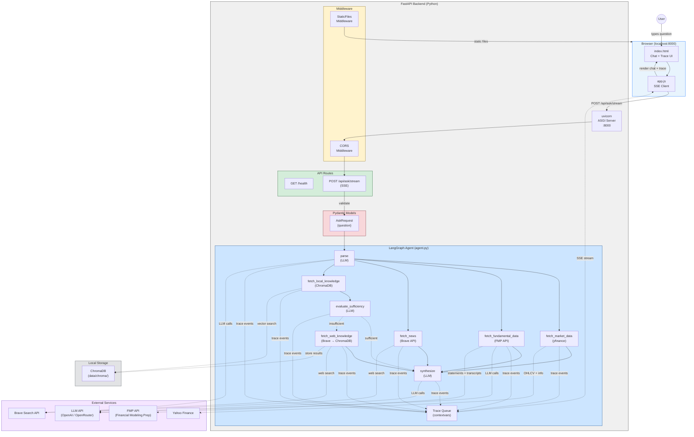

# Financial QA Agent

A financial question-answering agent with a Python/FastAPI backend and a vanilla web frontend for demo purposes.

## Quick Start

```bash
# Install dependencies
uv sync

# Copy and fill in environment variables
cp .env.example .env
# Edit .env with your API keys (LLM_API_KEY, BRAVE_API_KEY)

# Start the server (backend + frontend)
uv run uvicorn src.financial_qa_agent.main:app --reload --port 8000

# Open in browser
open http://localhost:8000

# Run tests
uv run pytest -v
```

---

## Architecture

### 1. System Architecture — Components, Data Flow & Interaction



**Interaction Pattern**: The frontend sends `POST /api/ask/stream` via `fetch()`. FastAPI validates through Pydantic, then launches the LangGraph agent with a trace queue. The agent parses the question into structured entities (tickers, time period, news flag, knowledge queries, fundamental data needs), then routes based on the parser's `question_type`: **analysis** (parser says analysis + tickers present → market data + optional fundamental data + optional news → sectioned answer: Fact + Analysis + References) or **knowledge hub** (parser says knowledge → local ChromaDB first → LLM evaluates sufficiency → if insufficient, web search → sectioned answer: Answer + References; tickers are ignored). For equity tickers, the parser can request FMP fundamental data (financial statements, earnings transcripts); transcripts are summarized via LLM before inclusion. The LLM produces markdown with `##` section headers; the frontend renders it via `marked.js` (sanitized with DOMPurify) so headers, links, lists, bold text, tables, and code all display correctly. Each pipeline stage emits trace events to an `asyncio.Queue`, which the SSE generator streams to the browser in real-time. The frontend renders trace events in a 4-tab trace panel (Agent Loop, Market Data with Price/Fundamental sub-sections, News, Knowledge with Local/Online sub-sections) and the final markdown answer in the chat panel.

---

### 2. Agent Loop — Question Processing Pipeline

```
User Question
     │
     ▼
┌─────────────┐
│    parse     │  ← LLM call: extract tickers, time period, news flag, knowledge queries
└──────┬──────┘
       │  (route by parser's question_type)
       │
       ├── analysis? ────── ANALYSIS PATH ─────────────────────────────────────────────┐
       │   └── fetch_market_data        (yfinance OHLCV + fundamentals)                  │
       │   └── [+ fetch_fundamental_data] (FMP: statements + transcripts, if equity)     │
       │   └── [+ fetch_news]           (Brave Search API, if needs_news)                │
       │                                                                                  │
       ├── knowledge? ──── KNOWLEDGE HUB (tickers ignored) ────────────────────────┐    │
       │   └── fetch_local_knowledge     (ChromaDB vector search)                    │    │
       │          │                                                                  │    │
       │          ▼                                                                  │    │
       │   ┌───────────────────────┐                                                 │    │
       │   │ evaluate_sufficiency   │  ← LLM: are local results enough?              │    │
       │   └──────────┬────────────┘                                                 │    │
       │              │                                                              │    │
       │      ┌───────┴────────┐                                                     │    │
       │      │                │                                                     │    │
       │   sufficient    insufficient                                                │    │
       │      │                │                                                     │    │
       │      │       fetch_web_knowledge  (Brave → store in ChromaDB)               │    │
       │      │                │                                                     │    │
       ▼      ▼                ▼                                                     ▼    ▼
┌─────────────┐                                                              ┌─────────────┐
│ synthesize   │  ← Knowledge prompt (## Answer + ## References)             │ synthesize   │
│ (knowledge)  │                                                             │ (analysis)   │
└──────┬──────┘                                                              └──────┬──────┘
       │                Analysis prompt (## Fact + ## Analysis + ## References) →    │
       ▼                                                                            ▼
┌─────────────┐
│  response    │  ← Frontend parses ## sections, renders clickable links
└─────────────┘
```

**Two question types** driven by the parse LLM's `question_type` field: **Analysis** (parser says "analysis" + tickers present) fetches market data, optionally FMP fundamental data (financial statements + earnings transcripts for equities), and optionally news, producing a sectioned answer: **Fact** (Key Metrics + Summary) + **Analysis** (interpretation) + **References** (news links, if available). **Knowledge** (parser says "knowledge") uses a **knowledge hub** approach: local ChromaDB is queried first, then an LLM evaluates whether the local results sufficiently answer the question — if not, a web search is triggered and results are stored in ChromaDB for future use. Knowledge questions ignore any tickers — no market data or fundamental data is fetched. The final answer is a sectioned response: **Answer** (explanation) + **References** (source links). The LLM outputs markdown; the frontend renders it natively via `marked.js` with DOMPurify sanitization.

---

### 3. Project Structure

```
financial-qa-agent/
├── README.md                       --- Project documentation with architecture diagrams
├── CLAUDE.md                       --- Development rules and conventions for Claude
├── pyproject.toml                  --- uv project config, dependencies, pytest settings
├── uv.lock                         --- Locked dependency versions
├── .env.example                    --- Template for required environment variables
├── .gitignore                      --- Git ignore rules
│
├── src/financial_qa_agent/         --- Backend Python package
│   ├── __init__.py                 --- Package marker
│   ├── config.py                   --- Settings via pydantic-settings (LLM, Brave, ChromaDB)
│   ├── main.py                     --- FastAPI app: routes, Pydantic models, static mount
│   ├── agent.py                    --- LangGraph agent: parse → fetch → synthesize pipeline
│   ├── models.py                   --- Pydantic models: TickerData, NewsResult, trace events, etc.
│   └── tools/                      --- Data fetching tool modules
│       ├── __init__.py             --- Tool exports
│       ├── market_data.py          --- yfinance: OHLCV, fundamentals (tickers from parse node)
│       ├── fundamental_data.py     --- FMP API: financial statements + earnings transcripts
│       ├── news_search.py          --- Brave Search API: recent financial news
│       └── knowledge_base.py       --- Local ChromaDB search + web search with auto-population
│
├── frontend/                       --- Vanilla web UI (no build step)
│   ├── index.html                  --- Two-panel layout + marked.js/DOMPurify CDN
│   ├── style.css                   --- Grid layout, markdown styles, trace entries
│   └── app.js                      --- SSE streaming, markdown rendering, trace panel
│
├── tests/                          --- Test suite (all externals mocked)
│   ├── __init__.py
│   ├── conftest.py                 --- Shared fixtures (mock LLM responses)
│   ├── test_api.py                 --- API endpoint + SSE stream tests (4 tests)
│   ├── test_agent.py               --- LangGraph pipeline + routing + trace tests (38 tests)
│   ├── test_models.py              --- Pydantic model unit tests (37 tests)
│   └── test_tools.py               --- Tool unit tests (40 tests)
│
├── specs/                          --- Living specifications
│   ├── api.md                      --- Endpoint contracts and response format
│   ├── architecture.md             --- Component overview and data flow
│   └── agent.md                    --- Agent loop design, state schema, tool interfaces
│
├── data/                           --- Runtime data (gitignored)
│   └── chroma/                     --- ChromaDB persistent vector storage
│
└── docs/                           --- Project history
    └── instructions.md             --- Timestamped log of every user instruction
```

---

## API Reference

| Method | Endpoint            | Description                          |
|--------|---------------------|--------------------------------------|
| POST   | `/api/ask/stream`   | Submit question with SSE trace streaming |
| GET    | `/health`           | Health check                         |

**Request** (`POST /api/ask/stream`):
```json
{ "question": "What is compound interest?" }
```

**SSE Stream**: Returns `text/event-stream` with events: `trace`, `tool_input`, `tool_output`, `answer`, `error`, `done`. See [`specs/api.md`](specs/api.md) for full SSE event reference.

---

## Development

| Command | Purpose |
|---------|---------|
| `uv sync` | Install / update dependencies |
| `uv run uvicorn src.financial_qa_agent.main:app --reload --port 8000` | Start dev server |
| `uv run pytest -v` | Run test suite |

### Project Conventions
- **Rules**: See [`CLAUDE.md`](CLAUDE.md) for all development rules
- **Specs**: See [`specs/`](specs/) for API and architecture specifications
- **Instruction log**: See [`docs/instructions.md`](docs/instructions.md) for full history

---

## Tech Stack

- **Backend**: Python 3.13+, FastAPI, uvicorn
- **Agent Orchestration**: [LangGraph](https://langchain-ai.github.io/langgraph/) (StateGraph)
- **LLM Provider**: [langchain-openai](https://python.langchain.com/docs/integrations/chat/openai/) (OpenAI / OpenRouter)
- **Market Data**: [yfinance](https://github.com/ranaroussi/yfinance) (OHLCV, fundamentals)
- **Fundamental Data**: [Financial Modeling Prep](https://financialmodelingprep.com/) (financial statements, earnings transcripts — free tier)
- **News Search**: [Brave Search API](https://brave.com/search/api/)
- **Knowledge Base**: [ChromaDB](https://www.trychroma.com/) (local vector DB with web fallback)
- **Frontend**: Vanilla HTML / CSS / JS (no build step)
- **Package Manager**: [uv](https://docs.astral.sh/uv/)
- **Testing**: pytest, pytest-asyncio, httpx


## 交付内容

- 系统架构图
    - 自动生成和维护了3个架构图在README的Architecture章节
      - System Architecture 主要展示的是前后端，数据库，外部数据接口相关的数据和交互流程。
      - Agent Loop 详细解释了后端Agent部分是怎么处理用户的query，构建context，获取最后回复的整个流程。
      - Project Structure 是文件粒度的实现内容
    - 会在视频中walk through一下架构

- 技术选型说明
  - 具体选型可以参考自动生成的Tech Stack章节，这边解释一下指导选型的一些rationale.
  - 前端: 我个人没有前端经验，所以主要逻辑都写在后端，前端就是一个静态页面排版和简单用stream api从后端获取数据的页面。
  - 后端：轻量级的FastApi做server，ChromaDB 作为demo使用的本地小vec db作为knowledge hub，额外需要的context数据通过专用的金融服务api，和通用的brave search API从外部获取。
  - Agent编排：用Langgraph编排简单的，确定性高agent workflow。

- Prompt 设计思路
  - 本项目目前主要用了以下几套prompt处理agent workflow里面的不同问题
  - 第一套prompt用于理解用户的输入
    - 区分输入是一个资产分析的需求，还是知识询问的需求
    - 针对这两种不同需求，还要求llm输出对应需求的后续workflow中所需要的参数，比如是否需要news，需求的数据的粒度和period如何，是否需要基本面数据，等等
  - 第二套prompt用于生成最后的回答输出
    - 规定了输出的具体格式，对应业务要求的"区分事实和分析内容"，"结构清晰"。
    - 将agent workflow中前几部分data retrieval做一个整合拼接到context中。
  - 还有一些小的prompt，和一些langchain"自带"的prompt，主要用于完成在agent workflow中的小任务，比如判断信息是否足够，做一些RAG过程中可能需要的summarization.

- 数据来源说明
  - 金融数据
    - 量价数据: yfinance, free tier
    - 基本面数据: FMP, free tier，只支持income statement用于demo
  - web search: Brave API, free tier

- 优化扩展
  - 首先需要优化的是session management。目前每一个user input都是作为一个独立的输入进入agent loop，但更合理的方式是做一个简单的session概念，把session内部的q&a内容放进或者embedding进context，作为回答输出的上下文一部分。

  - 其次需要优化的是现在的agent loop。用langgraph或者其他类似的工具认为编排整个agent flow其实并不是一个好的选择。生产系统上应当使用基于ReAct Loop的Agent Harness。
    - 他的优点在于确定性高，编写的预期比较明确，解决简单固定的agent任务落地快容易调试。
    - 他的缺点是，迭代维护起来会很麻烦，需求一动要改workflow而且动一个节点上下游都可能受到影响。而且对于复杂模糊的任务，人工抽象workflow可能会有数不清的补丁要打才能达到不断演进的需求，输入的corner case之类的情况。
    - 更主要的问题是，在模型能力已经非常强的现在，agent workflow对应的planning或者reasoning的能力基模早已经具备，更好的选择是作为agent开发，只需要一个通过的ReAct loop，和一系列调试过有效的相关tooling和skilling，然后让模型自身通过loop来动态生成每一个user request的执行workflow。
  
  - 另外必须优化的是数据源。现在的结构化数据和非结构化数据是直接从金融服务和搜索API中获取，但如果要严肃的做一个金融Q&A Agent，应该需要维护自己的数据仓库。
    - 原因一，对于Market Data，有直接的性能，成本，稳定性的考虑。
    - 原因二，对于news这类非结构化数据，直接通过search API能获得的质量是非常差的，需要大量的甄别清洗，提炼出高质量的数据，标注metadata，后续的分析才能有实际的交易价值。
    - 原因三，knowledge hub的构建，也需要大量的爬取来构造知识库，否则能retrieve到的甚至不如基座模型自带的语料。也因此，本项目的vec db只是为了演示流程和concept。

  - 再次需要优化的Agent Loop对于不同输入有可能产生的异常和对应的处理，做这件事需要通过大量的内部test case构造，以及在上线后定期地根据线上数据改进tooling & prompts，甚至对于基座模型做RL（根据我的了解，除了coding agent还比较少有做到这一步的）。