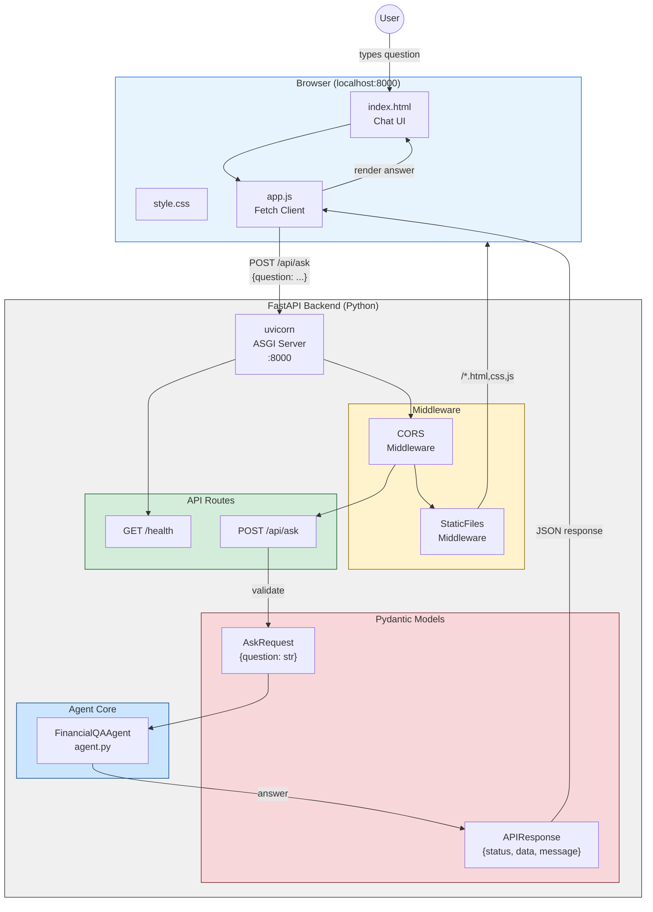
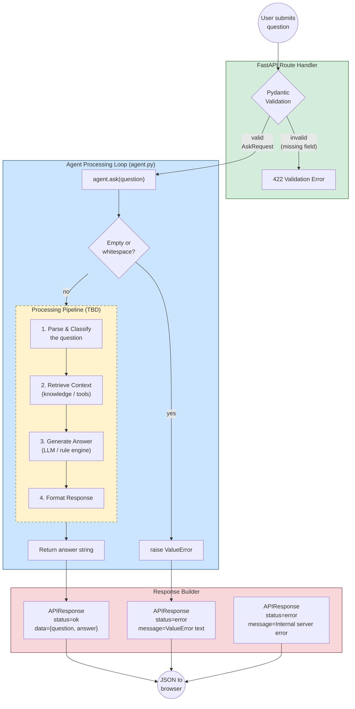
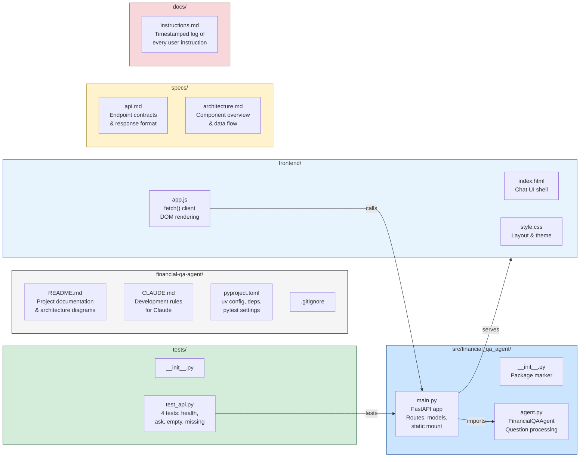

# Financial QA Agent

A financial question-answering agent with a Python/FastAPI backend and a vanilla web frontend for demo purposes.

## Quick Start

```bash
# Install dependencies
uv sync

# Start the server (backend + frontend)
uv run uvicorn src.financial_qa_agent.main:app --reload --port 8000

# Open in browser
open http://localhost:8000

# Run tests
uv run pytest -v
```

---

## Architecture

### 1. System Architecture — Components, Data Flow & Interaction



**Interaction Pattern**: The frontend is a single-page chat UI that sends `POST /api/ask` requests via `fetch()`. The backend validates the input through Pydantic, delegates to the agent, and returns a JSON envelope `{status, data, message}`. The same uvicorn process serves both the API and the static frontend files.

---

### 2. Agent Loop — Question Processing Pipeline



> **Note**: The inner "Processing Pipeline" steps (parse, retrieve, generate, format) are placeholders. The agent currently returns a stub response. The actual behavior — LLM integration, tool use, retrieval strategy — will be defined in a future iteration.

---

### 3. Project Structure — Files & Responsibilities



---

## API Reference

| Method | Endpoint     | Description                  |
|--------|-------------|------------------------------|
| POST   | `/api/ask`  | Submit a financial question  |
| GET    | `/health`   | Health check                 |

**Request** (`POST /api/ask`):
```json
{ "question": "What is compound interest?" }
```

**Response**:
```json
{
  "status": "ok",
  "data": {
    "question": "What is compound interest?",
    "answer": "..."
  },
  "message": "Question answered successfully"
}
```

All responses follow the envelope: `{ status, data, message }`

---

## Development

| Command | Purpose |
|---------|---------|
| `uv sync` | Install / update dependencies |
| `uv run uvicorn src.financial_qa_agent.main:app --reload --port 8000` | Start dev server |
| `uv run pytest -v` | Run test suite |

### Project Conventions
- **Rules**: See [`CLAUDE.md`](CLAUDE.md) for all development rules
- **Specs**: See [`specs/`](specs/) for API and architecture specifications
- **Instruction log**: See [`docs/instructions.md`](docs/instructions.md) for full history

---

## Tech Stack

- **Backend**: Python 3.13+, FastAPI, uvicorn
- **Frontend**: Vanilla HTML / CSS / JS (no build step)
- **Package Manager**: [uv](https://docs.astral.sh/uv/)
- **Testing**: pytest, pytest-asyncio, httpx
